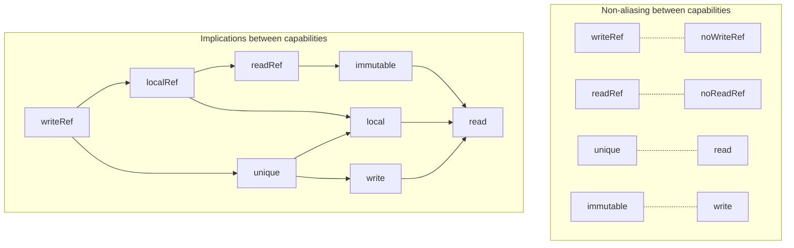

# Mendel, a verifier for safe Rust clients of interior mutability

[](https://github.com/viperproject/mendel-verifier/actions/workflows/test.yml?query=branch%3Amaster)
[](https://github.com/viperproject/mendel-verifier/actions/workflows/deploy.yml?query=branch%3Amaster)
[](https://codecov.io/gh/viperproject/mendel-verifier)
[](https://prusti.zulipchat.com/)


**[Mendel](https://github.com/viperproject/mendel-verifier)** is a prototype verifier for safe Rust that uses a novel capability-based technique to enable reasoning about some cases of **interior mutability** of trusted real-world libraries, among which `Rc`, `Arc`, `Cell`, `RefCell`, `Atomic*`, `Mutex` and `RwLock`, requiring minimal client-side annotations.
The key concept is a novel notion of **implicit library capability**, which can be used to describe library properties that were decided by the library developers, such as the immutability implied by `Ref` or the non-aliasing implied by `RefMut`.
In contrast, the *explicit* properties of the Rust language, such as the immutability of shared references to primitive types, are defined by the Rust language and cannot be changed or defined by the library developers.
The implicit capabilities of a library cannot be discovered automatically just by inspecting the type declarations because these typically just contain opaque raw pointers or `UnsafeCell` instances.
To solve this, our verifier provides library annotations that make it possible to explicitly declare the implicit capabilities of library types, making them available for automated tools.

The implementation of Mendel largely reuses [Prusti's codebase](https://github.com/viperproject/prusti-dev), and all Mendel-specific code is contained in [`prusti-viper/src/encoder/safe_clients`](prusti-viper/src/encoder/safe_clients) (~12K lines of code).
Both verifiers internally encode Rust programs into the [Viper language](http://www.pm.inf.ethz.ch/research/viper.html).
However, the verification techniques are different: Prusti employs separation logic to prove functional correctness and some memory safety properties, while Mendel fully trusts the compiler and uses its type information to encode capabilities into first-order logic.
Unlike the current version of Prusti, Mendel natively supports reasoning about memory addresses (e.g., raw pointer comparisons, casts from references to pointers, `addr_of!`, etc.) and in general supports more types (e.g., structures containing references). However, (1) Mendel's technique is less complete than Prusti's when reasoning about safe code (e.g., mutably borrowing in a code branch), (2) unlike Prusti, Mendel does not verify postconditions with pledges, and (3) Mendel's language support is generally limited because of implementation time constraints, notably lacking support for loops and quantifications.

The goal of Mendel is to demonstrate the viability of a capability-based approach for verifying usages of Rust libraries implemented with unsafe code, making it possible to evaluate its pros and cons. Our aim is to help or inspire future versions of other deductive verifiers for Rust.

If you have any questions, please feel free to contact us on [Prusti's Zulip chat](https://prusti.zulipchat.com/).

> [!NOTE]
> The project's name refers to Gregor Mendel, the father of modern genetics, who paved the way for studies of _capabilities_ and _mutations_ of DNA. Our project, instead, studies the _capabilities_ and _interior mutability_ of Rust libraries.

## Test suite and evaluation

The test suite and evaluation can be found in the [`prusti-tests/tests/verify_safe_clients/fail`](prusti-tests/tests/verify_safe_clients/fail) folder. Inside it, there are 3 subfolders:
- **[`clients`](prusti-tests/tests/verify_safe_clients/fail/clients)** contains the verified clients used in the evaluation. Among many small hand-written programs, this folder includes two programs that show how to do [Verus](https://github.com/verus-lang/verus)-style reasoning using Mendel (`verus_*.rs`).
- **[`tutorials`](prusti-tests/tests/verify_safe_clients/fail/tutorials)** contains two programs taken from the [interior mutability chapter](https://dhghomon.github.io/easy_rust/Chapter_41.html) of the Easy Rust tutorial.
- **[`libraries`](prusti-tests/tests/verify_safe_clients/fail/libraries)** contains the annotations of the libraries used by the clients and tutorials.
- **[`dev_tests`](prusti-tests/tests/verify_safe_clients/fail/dev_tests)** contains various programs used to test the end-to-end behavior of the verifier.

## Capability annotations

> [!NOTE]
> This is a brief summary! Read chapter 4 of Federico Poli's PhD thesis for more examples and an in-depth description.

This tool provides the following annotation to declare the implicit capabilities of library types with interior mutability:
```rust
#[capabile(<source> if <condition> => <capability>(<target>))]
impl <type> {}
```
The meaning of this annotation is the following: As long as `<condition>` holds (`true` if omitted), `<source>` holds a capability `<capability>` for the memory location `<target>`.

### Example

```rust
// The full specification of the library is in "libraries/refcell_*.rs"

#[capable(&self => readRef(self.refcell().as_ptr()))]
impl<'b, T> Ref<'b, T> {}

#[capable(&mut self => writeRef(self.refcell().as_ptr()))]
impl<'b, T> RefMut<'b, T> {}
```
Meaning: Any `&Ref` instance holds a `readRef` capability for the content of the `RefCell` it refers to, and any `&mut RefMut` instance holds instead a `writeRef` capability.

In other words, any `&Ref` can be used to obtain a shared reference to the content of the `RefCell`, and any `&mut RefMut` can be used to obtain a mutable reference. This has some useful implications: holding a `&Ref` implies immutability of the content of the `RefCell`, and `RefMut` instances cannot refer to the content of other `Ref` or `RefMut` instances.

### Capability kinds

A brief summary of the capability kinds and their meaning:

| Capability  | Description | Example |
|-------------|-------------|---------|
| `writeRef`  | The source can obtain a mutable reference to the target. | `&mut` |
| `readRef`   | The source can obtain a shared reference to the target. | `&` |
| `localRef`  | The target is `readRef` and `local`. | ... |
| `unique`    | The target can be accessed only via the source place. | Content of `&mut Cell` |
| `local`     | The target is thread-local. | Content of `&RefCell` |
| `write`     | The target can be written via the source. | Content of `&AtomicI32` |
| `immutable` | The target is immutable. | The borrow-count of a `&RefMut` |
| `read`      | The target can be read via the source. | ... |
| `noWriteRef`  | It is impossible to obtain a mutable reference to the target. | Content of `&Cell`, content of a read-locked `&RwLock` |
| `noReadRef`   | It is impossible to obtain a shared reference to the target. | Content of `&Cell` |

### Capability properties

A diagram representing the implication and non-aliasing relationships between the capabilities:



## Using Mendel

**Command line**

There are two ways to obtain the binaries of the Mendel verifier:
* Download the precompiled binaries for Ubuntu, Windows, or macOS x64 from a [GitHub release](https://github.com/viperproject/mendel-verifier/releases).
* Compile from the source code, by installing [rustup](https://rustup.rs/), running `./x.py setup` and then `./x.py build --release`.

Both options provide the `prusti-rustc` and `cargo-prusti` programs that can be used analogously to, respectively, `rustc` and `cargo build`. The names of the binaries contain "prusti" because of compatibility reasons (and lack of time), but the verifier is actually Mendel.

**IDE**

The binaries of Mendel are compatible with the ["Prusti Assistant"](https://marketplace.visualstudio.com/items?itemName=viper-admin.prusti-assistant) extension for VS Code. See the _requirements_ and the troubleshooting section in its [readme](https://github.com/viperproject/prusti-assistant/blob/master/README.md). To use Mendel in the IDE, you should configure the Prusti Assistant extension to use Mendel's binaries, specifying the "Local" version of the verifier and the path of the folder containing the binaries.
